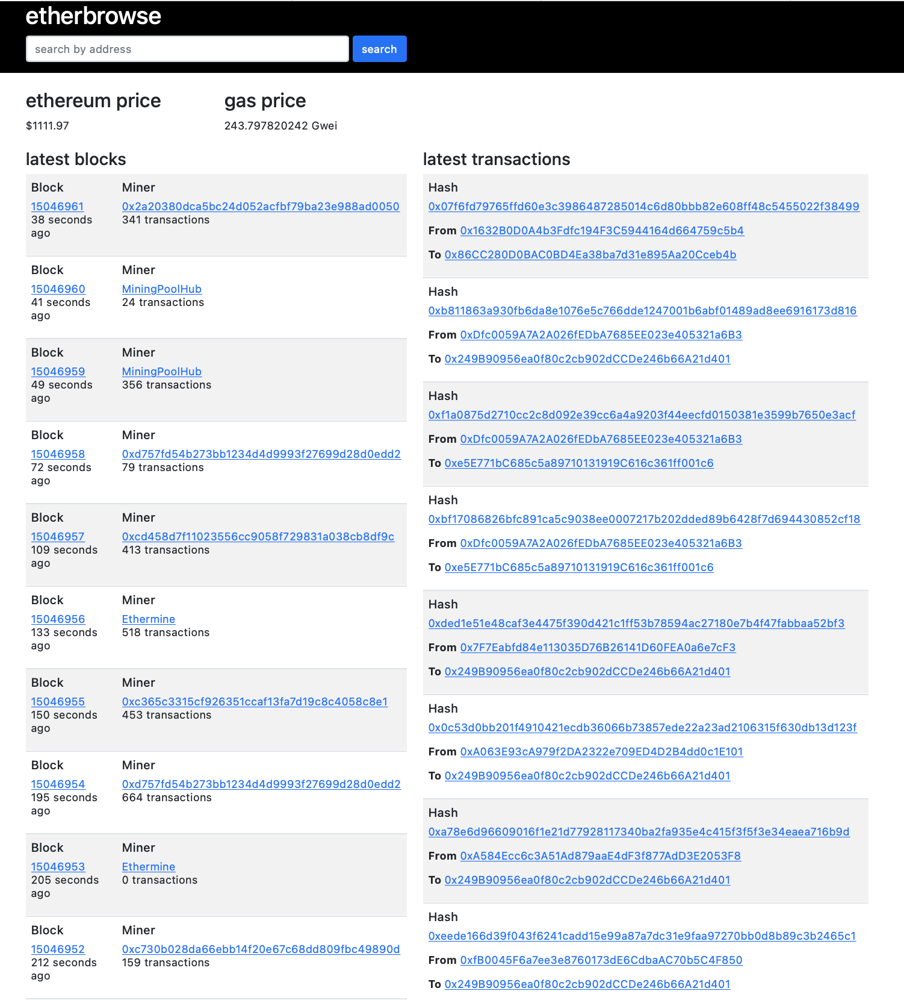

# Build your own Etherscan with web3.py

## Before you run it

In order to run the code, you need to 
- Have a (Free) account created at https://infura.io/
- Create New Project; 
    - Under "Product" select "Ethereum"
    - Enter any "Project Name"
- Copy the Endpoint URL that looks like this https://mainnet.infura.io/v3/xxxxxxxxxxxxxxxxxxxxxxxxxxxxxxxx
- Create a .env file and store INFURA_URL = "https://mainnet.infura.io/v3/xxxxxxxxxxxxxxxxxxxxxxxxxxxxxxxx" and save the file

## Run it

pip3 install -r requirements.txt

export FLASK_APP=app

export FLASK_ENV=development

flask run

## Screenshot:

## Reference: 

Video Tutorial: https://www.youtube.com/watch?v=XcHNWuMietY

